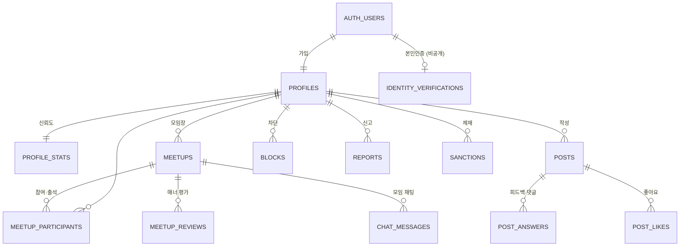

# DB 구조 v1 (Supabase)

작성일: 2026-09-24 · 상태: 마이그레이션 작성·테스트 완료, Supabase 프로젝트에 적용 전

- 마이그레이션: [`../supabase/migrations/`](../supabase/migrations/) (순서대로 4개 파일)
- 테스트: [`../supabase/tests/db.test.mjs`](../supabase/tests/db.test.mjs) (29개, 로컬 Postgres 16에서 통과)
- 규칙의 근거: [`07-operations-policy.md`](07-operations-policy.md)

## 1. 설계 원칙

1. **규칙은 DB가 지킨다.** 정원, 대상 제한, 노쇼 제한, 차단, 늦은 취소 같은 규칙을 앱에서만 확인하면 앱을 고쳐서 우회할 수 있습니다. 그래서 같은 규칙을 DB에도 둡니다.
2. **복잡한 변경은 함수로만 한다.** 참여 신청·취소·승인·출석·제재는 테이블에 직접 쓰지 못하고 정해진 함수(RPC)로만 바꿉니다. 동시에 신청해도 정원을 넘지 않도록 모임 행을 잠급니다.
3. **열 단위로 권한을 준다.** Supabase가 기본으로 주는 테이블 권한을 모두 거두고, 사용자가 써도 되는 열에만 다시 줍니다. 작성자, 본인인증 상태, 창립 모임장, 좋아요·답변 수는 사용자가 직접 바꿀 수 없습니다.
4. **개인정보는 최소한만.** 주민등록번호와 생년월일 전체는 저장하지 않습니다. 본인인증 CI는 해시로, 나이는 출생 연도로만 두고, 이 테이블은 누구도 API로 읽을 수 없습니다.

## 2. 테이블



| 테이블 | 내용 | 누가 읽나 | 누가 쓰나 |
|---|---|---|---|
| `profiles` | 이름, 활동 유형, 연령대, 지역, 장르, 소개, 창립 모임장, 인증 시각 | 로그인한 사람 | 본인 (이름·유형·지역·장르·소개만) |
| `profile_stats` | 참석, 노쇼, 늦은 취소, 모임 개설·취소, 매너 평균 | 로그인한 사람 | 트리거가 자동 계산 |
| `identity_verifications` | CI 해시, 출생 연도, 인증 대행사 | 아무도 (서버만) | 서버 함수 |
| `banned_identities` | 영구 정지된 CI 해시 | 아무도 (서버만) | 관리자 함수 |
| `meetups` | 모임 정보, 장소 좌표, 시간, 정원, 참가비, 대상, 승인제 | 차단한 사이가 아닌 사람 | 자격 있는 모임장 |
| `meetup_participants` | 신청 상태, 늦은 취소, 출석 | 본인, 모임장, 확정 참여자 목록 | 함수로만 |
| `meetup_reviews` | 매너 점수 1~5 | 내가 남긴 것만 | 함께 참석한 사람 |
| `chat_messages` | 모임 채팅 | 확정 참여자 | 확정 참여자 |
| `posts` | 피드백 요청·라운지·Q&A, 사진 경로, 촬영 정보 | 공개 글 + 내 글 | 인증한 회원 |
| `post_answers` / `post_likes` | 피드백·댓글 / 좋아요 | 볼 수 있는 글의 것 | 인증한 회원 / 본인 |
| `blocks` | 차단 | 내 차단 목록만 | 본인 |
| `reports` | 신고와 처리 상태 | 신고자, 관리자 | 신고자 |
| `sanctions` | 경고·7일·30일·영구 정지 | 본인, 관리자 | 관리자 함수 |

사진 파일은 Supabase Storage의 비공개 버킷 `post-photos`에 `{내 user id}/파일명.jpg`로 올립니다 (JPEG만, 5MB 이하).

## 3. 규칙이 지켜지는 곳

| 운영정책 규칙 | DB에서 지키는 방법 | 테스트 |
|---|---|---|
| 로그인하지 않으면 아무것도 볼 수 없음 | anon 역할의 테이블·함수 권한 전부 제거 | 가입과 본인인증 1 |
| 만 19세 이상, 1인 1계정 (D3) | `record_identity_verification`: 나이·중복·정지 확인 | 가입과 본인인증 3 |
| 모임 개설: 참석 1회 이상 또는 창립 모임장 (4-1) | `can_host` + 모임 insert 정책 | 모임 만들기 1, 2 |
| 모델 섭외 촬영회 금지 (4-1) | `meetups_no_model_shoot` 제약 | 모임 만들기 3 |
| 1시간 뒤부터, 최대 12시간, 실비는 용도 필수 | 트리거와 CHECK 제약 | 모임 만들기 3 |
| 정원, 대상 유형·연령대, 승인제 | `join_meetup` (모임 행을 잠그고 확인) | 참여 신청 2, 3 |
| 24시간 이내 취소는 늦은 취소 (4-2) | `cancel_participation` | 참여 신청 5 |
| 노쇼 90일 2회 14일, 3회 30일 후 승인제 (4-2) | `no_show_restriction` (앱 `noShow.ts`와 같은 규칙) | 출석과 노쇼 2, 3 |
| 출석은 모임장이, 시작 후 7일 안에 | `mark_attendance` | 출석과 노쇼 1 |
| 매너 평가는 함께 참석한 사람만, 끝나고 7일 안에 | `can_review` + insert 정책 | 매너 평가 |
| 받은 개별 점수는 비공개, 평균만 공개 | reviews select 정책 + `profile_stats.manner_avg` | 매너 평가 |
| 채팅은 확정 참여자만 (D6: 1:1 메시지 없음) | chat 정책, 1:1 테이블 없음 | 모임 채팅 |
| 차단하면 양쪽 모두 서로 안 보임 (3절) | `is_blocked_between`를 모든 읽기 정책에 | 참여 신청 4, 채팅, 커뮤니티 3 |
| 사진 GPS 저장 금지 (D2) | `posts_exif_whitelist`: 촬영 정보 6개 키만 | 커뮤니티 1 |
| 인물 사진은 동의 체크 필수 (3절) | `posts_person_consent` | 커뮤니티 1 |
| 불법 촬영 신고는 즉시 가림 (5-1, 5-4) | 신고 트리거가 글·답변·채팅을 숨김 | 신고와 관리자 1 |
| 제재 중에는 참여·글쓰기 불가 (5-3) | `is_sanctioned`를 정책·함수에서 확인 | 커뮤니티 3 |
| 영구 정지자 재가입 차단 (5-3) | `apply_sanction` → `banned_identities` | 신고와 관리자 2 |
| 앱 안 계정 삭제 (D5) | `delete_my_account` → 연결된 데이터 삭제, 신고 기록만 익명으로 남김 | 계정 삭제 |

## 4. 앱이 부르는 함수

오류가 나면 `hint`에 기계용 코드가 들어갑니다. 앱은 이 코드로 안내 문구를 고릅니다. 메시지는 이미 한국어로 되어 있어 그대로 보여 줘도 됩니다.

| 함수 | 하는 일 | 주요 오류 코드 |
|---|---|---|
| `join_meetup(meetup_id)` | 참여 신청. `pending` 또는 `confirmed` 반환 | `meetup_full`, `not_target_type`, `not_target_age`, `no_show_blocked`, `approval_only`, `declined`, `sanctioned`, `not_verified` |
| `cancel_participation(meetup_id)` | 참여 취소. 늦은 취소였는지 반환 | `meetup_started`, `host_cannot_leave` |
| `decide_join_request(meetup_id, user_id, approve)` | 모임장의 승인·거절 | `not_host`, `not_pending`, `meetup_full` |
| `mark_attendance(meetup_id, user_id, attended)` | 모임장의 출석 체크 | `not_started`, `attendance_closed` |
| `cancel_meetup(meetup_id, reason)` | 모임장의 모임 취소 | `meetup_started` |
| `no_show_restriction(user_id)` | 노쇼 제한 상태 (`none`, `warning`, `blocked`, `approval_only`) | |
| `delete_my_account()` | 계정 삭제 | |
| `moderate_content`, `apply_sanction`, `resolve_report`, `set_founding_host` | 관리자 전용 | `not_admin` |

모임 만들기, 글·답변·좋아요, 차단, 신고, 매너 평가는 테이블에 바로 insert합니다. 작성자 열은 로그인한 사람으로 자동으로 채워집니다.

## 5. Supabase에 적용하기

1. [supabase.com](https://supabase.com)에서 프로젝트를 만듭니다. 지역은 **Northeast Asia (Seoul)** 을 고릅니다.
2. 다음 중 한 가지로 마이그레이션을 적용합니다.
   - 대시보드 **SQL Editor**에 `supabase/migrations/`의 파일 4개를 이름 순서대로 붙여 넣고 실행
   - 또는 Supabase CLI: `supabase link --project-ref <프로젝트 ID>` 후 `supabase db push`
3. 관리자 계정은 대시보드의 Authentication에서 해당 사용자의 `app_metadata`에 `{"role": "admin"}`을 넣어 지정합니다.
4. 매년 1월 1일에 연령대를 다시 계산하도록 `pg_cron`으로 `select public.refresh_age_bands();`를 예약합니다.
5. 앱의 접속 정보(Project URL, anon key)는 `mobile/.env.local`에 `EXPO_PUBLIC_SUPABASE_URL`, `EXPO_PUBLIC_SUPABASE_ANON_KEY`로 넣습니다. 이 파일은 git에 올라가지 않습니다. **service role 키는 앱과 저장소 어디에도 넣지 않습니다.**

새 테이블을 추가할 때는 Supabase가 기본으로 모든 권한을 주므로 `20260924100200_policies.sql`처럼 먼저 권한을 거두고 필요한 것만 다시 줍니다.

## 6. 테스트하기

Postgres 16 이상이 있는 컴퓨터에서 실행합니다. 테스트는 새 데이터베이스를 만들어 쓰고 끝나면 지웁니다.

```bash
cd supabase
npm install
DATABASE_URL=postgres://postgres@127.0.0.1:5432/postgres npm test
```

`tests/supabase_stub.sql`이 Supabase의 역할(anon, authenticated, service_role), `auth.uid()`, storage 스키마를 흉내 냅니다. Supabase가 기본으로 주는 넓은 권한도 똑같이 줘서, 마이그레이션이 그 권한을 제대로 거두는지 확인합니다.

## 7. 남은 일

| 일 | 내용 |
|---|---|
| 본인인증 Edge Function | PASS 대행사 응답을 받아 CI를 해시하고 `record_identity_verification`을 부름. 해시에는 서버 비밀값(pepper)을 섞음 |
| 계정 삭제 Edge Function | Apple 로그인 토큰을 해지한 뒤 `delete_my_account` (Apple 5.1.1(v)) |
| 사진 서버 처리 | 업로드된 사진을 서버에서 한 번 더 다시 저장해 EXIF 제거 (운영정책 D2 두 번째 단계) |
| 푸시 알림 | 승인·거절, 모임 전날, 취소, 신고 결과 |
| 앱 연결 | `mobile/src/data/store.tsx`의 동작을 supabase-js 호출로 바꾸기, `supabase gen types`로 타입 생성 |
| 앱 온보딩 변경 | 연령대는 본인인증 결과로 자동으로 정해지므로 온보딩의 연령대 질문을 뺀다 |
| 시드 데이터 | 로컬 개발용 `supabase/seed.sql` (앱의 예시 데이터와 같은 내용) |

**확인 필요** (운영정책 8절과 연결)

- 영구 정지자 CI 해시를 얼마나 보관할 수 있는지 (8절 5번). 지금은 기간 없이 보관합니다.
- 연령대는 출생 연도로만 계산해서 생일 전후로 1살 차이가 날 수 있습니다. 가입 제한(만 19세)은 인증 시점의 생년월일 전체로 정확히 확인합니다.
